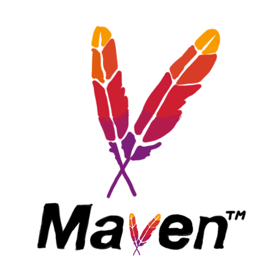
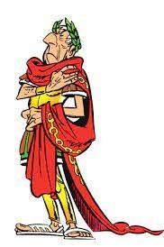

<!-- _Slide 1: Title Slide_ -->
# Practical work's presentation
## CryptoTool &rarr; application with JAVA/Maven/Picocli/GitHub

Author: **David Schildböck & Arno Tribolet**  
Date: October 2024

GitHub repo &rarr; 
**https://github.com/arnoheigvd/DAI_labo1_Schildbock_Tribolet**

---

<!-- _Slide 2: Introduction_ -->
# Plan/Introduction  
- The workflow GitHub
- The CLI application - Caesar cypher and AES algorithm
- Conclusion / Questions

\
*It is a capital mistake to theorize before one has data. Yet, every misstep brings us closer to the truth.* 
by **Sherlock Holmes**

---

<!-- _Slide 3: Main Content - GitHub_ -->
# Workflow GitHub
- Issue, New branch, Work on local, Commit and push, Pull Request (Validation by the other team-mate), Merge

---

<!-- _Slide 4: Main Content - CLI Application_ -->
# CLI Application
- **JAVA** - the language used
- **Maven Wrapper** - a tool used to create a java archive (**JAR**) 
- **Picocli** - a library used to create a CLI(Command Line Interface) application

 

    
    
    

---

<!-- _Slide 5: Main Content - Caesar cipher_ -->
# Caesar cipher
- Take a **shift key**(k)
- Take the **character**(c) and change it to **c+k**
- Example &rarr; c=A, k=1 &rarr; **A+1 = B**

Julius Caesar, namesake of the Caesar cipher

---

<!-- _Slide 6: Main Content - AES algorithm_ -->
# AES(Advanced Encryption Standard) algorithm
- Widely used symmetric encryption algorithm
- Implemented the ECB(Electronic Codebook) mode 
    - Each plaintext block is encrypted independently
- **Pros** &rarr; Simple and fast, suitable for encrypting individual blocks of data.
- **Cons** &rarr; Identical plaintext blocks produce identical ciphertext blocks, **leading** to pattern leakage and weaker security.

---

<!-- _Slide 7: Conclusion_ -->
# Conclusion  
- Learned a lot
- Fun
- **Questions ??**

&rarr; Read our <strong>README.md</strong> for more information !

---

<!-- _Ending_ -->

