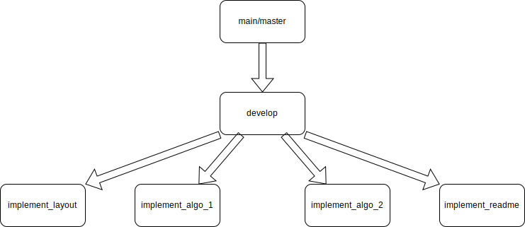

<!-- _Slide 1: Title Slide_ -->
# Practical work's presentation
## CryptoTool &rarr; application with JAVA/Maven/Picocli/GitHub

Author: **David Schildböck & Arno Tribolet**  
Date: October 2024

---

<!-- _Slide 2: Introduction_ -->
# Plan/Introduction  
- The workflow GitHub
- The CLI application - Ceasar cypher and AES algorithm
- Conclusion / Questions

---

<!-- _Slide 3: Main Content - GitHub_ -->
# Workflow GitHub
- Issue, New branch, Work on local, Commit and push, Pull Request (Validation by the other team-mate), Merge

---

<!-- _Slide 4: Main Content - CLI Application_ -->
# CLI Application
- **JAVA** - the language used
- **Maven Wrapper** - a tool used to create a java archive (JAR) 
- **Picocli** - a library used to create a CLI application

---

<!-- _Slide 5: Main Content - Ceasar cipher_ -->
# Ceasar cipher
- Take a **shift key**(k)
- Take the **character**(c) and change it to **c+k**
- Example &rarr; c=A, k=1 &rarr; A+1 = B

---

<!-- _Slide 6: Main Content - AES algorithm_ -->
# AES(Advanced Encryption Standard) algorithm
- Widely used symmetric encryption algorithm
- Implemented the ECB(Electronic Codebook) mode 
    - Each plaintext block is encrypted independently
- **Pros** &rarr; Simple and fast, suitable for encrypting individual blocks of data.
- **Cons** &rarr; Identical plaintext blocks produce identical ciphertext blocks, **leading** to pattern leakage and weaker security.

---

<!-- _Slide 7: Conclusion_ -->
# Conclusion  
- Learned a lot
- Fun
- **Questions ??**

---

<!-- _Ending_ -->

